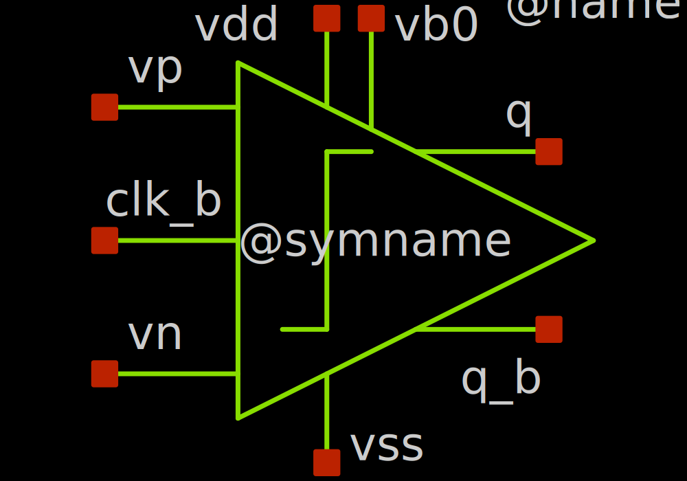
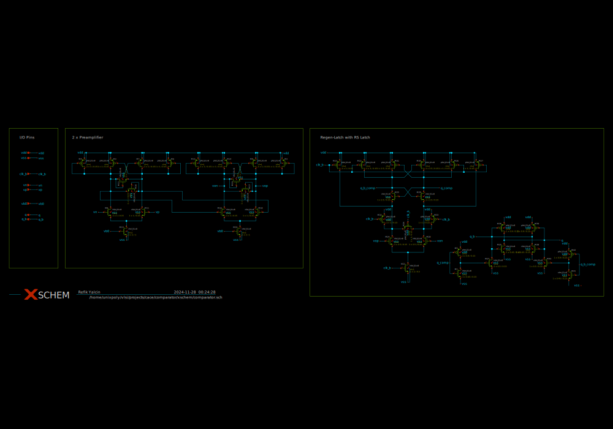
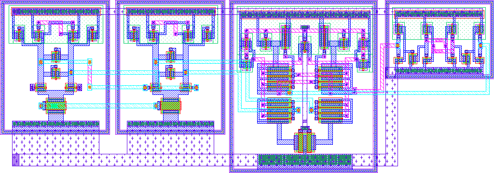
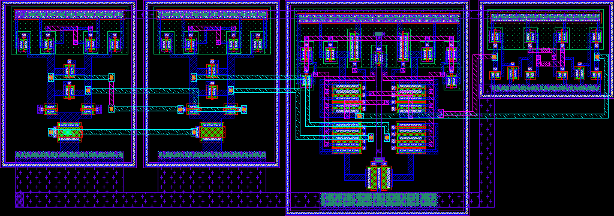

# comparator

- Description: Strong ARM latch with cascaded preamplifier
- PDK: sky130A

## Authorship

- Designer: Refik Yalcin
- Company: uwaterloo
- Created: January 5, 2024
- License: Apache 2.0
- Last modified: None

## Pins

- vn
  + Description: comparator negative input
  + Type: signal
  + Direction: input
  + Vmin: vss
  + Vmax: vdd
- vp
  + Description: comparator positive input
  + Type: signal
  + Direction: input
  + Vmin: vss
  + Vmax: vdd
- vb0
  + Description: preamplifier bias voltage
  + Type: power
  + Direction: input
  + Vmin: 0.9
  + Vmax: 1.1
- q
  + Description: amplifier voltage output
  + Type: signal
  + Direction: output
  + Vmin: vss
  + Vmax: vdd
- q_b
  + Description: Analog power supply
  + Type: signal
  + Direction: output
  + Vmin: vss
  + Vmax: vdd
- clk_b
  + Description: Comparator Clock
  + Type: signal
  + Direction: input
  + Vmin: 0
  + Vmax: 1.8
- vdd
  + Description: Analog power supply
  + Type: power
  + Direction: inout
  + Vmin: 1.7
  + Vmax: 1.9
- vss
  + Description: Analog ground
  + Type: ground
  + Direction: inout
  + Vmin: -0.3
  + Vmax: 0.3

## Default Conditions

- vdd
  + Description: Analog power supply voltage
  + Display: Vdd
  + Unit: V
  + Typical: 1.8
- vb0
  + Description: Bias voltage
  + Display: vb0
  + Unit: V
  + Typical: 1
- cl
  + Description: Output load capacitance
  + Display: CLoad
  + Unit: pF
  + Maximum: 1
- corner
  + Description: Process corner
  + Display: Corner
  + Typical: tt
- temperature
  + Description: Ambient temperature
  + Display: Temp
  + Unit: °C
  + Typical: 27

## Symbol

## Schematic

## Layout

